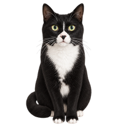

# My Cute Pussy Rich · 绿眸猫咪桌宠

一只根据真实黑白猫照片制作的 Windows 桌面小猫。全身透明、绿眼睛、白胸口和白脚尖，摸摸头就会回应并播放猫咪原声。



## 开始使用

需要 Windows 10/11 和系统自带的 Windows PowerShell 5.1（WPF）。无需 Python、Node.js 或 Codex，也不需要联网。

1. 点击本仓库 **Code → Download ZIP**，解压整个文件夹。
2. 双击 `launch-cat.cmd`。
3. 保持 `desktop-cat.ps1`、`cat-atlas.png` 和 `meow.wav` 与启动文件放在一起。

启动器仅为当前进程指定执行策略，不修改系统执行策略或添加开机启动。若组织策略禁止运行脚本，请遵循设备管理要求。

## 互动

| 操作 | 效果 |
| --- | --- |
| 点击头部 / 按空格 | 抬爪、爱心和猫叫 |
| 按住并拖动 | 移动小猫，按左右方向播放奔跑动画 |
| 滚轮 | 等比例缩放，宽度 96–384，默认 192 |
| 右键菜单 | 摸头、跳跃、声音开关、关闭 |
| Esc | 关闭 |

默认置顶，不显示任务栏入口。右键小猫选择 **Close** 会停止动画和声音并退出进程。按键操作需要小猫窗口获得焦点。鼠标移动可触发不同方向的注视。

Windows 版待机约每 7.4 秒眨眼一次，保持头部和身体不动，仅更新眼睛区域。

## 素材与自定义

- `cat-atlas.png`：1536 × 2288 的透明图集，8 列 × 11 行，每格 192 × 208。
- `meow.wav`：来自作者提供的猫咪视频，约 1.15 秒，单声道 44.1 kHz、16 位 PCM WAV，已调整音量及首尾淡入淡出。
- `cat-preview.png`：项目预览。

可以替换 `meow.wav`；为保持兼容，使用 16 位 PCM WAV。替换图集时应保持尺寸和动画布局不变。图像由 AI 根据作者的猫咪照片生成并整理成动画；原始照片和视频不包含在仓库中。

## 开发与验证

在项目目录运行：

```powershell
# 校验图集及声音文件可加载
powershell.exe -NoProfile -ExecutionPolicy Bypass -STA -File .\desktop-cat.ps1 -ValidateOnly

# 打开短暂的静音测试窗口，验证缩放、奔跑切换及摸头动画
powershell.exe -NoProfile -ExecutionPolicy Bypass -STA -File .\desktop-cat.ps1 -SelfTest
```

自检结果及截图保存在 `.test-output/`，不提交到 Git。自检不代替真实鼠标操作或音频试听。

## 浏览器版与 Codex 宠物包

- 浏览器版：直接打开 `interactive-cat.html`，支持摸头、跳跃、拖动及合成猫叫；该页面尚未换成 Windows 版使用的原声。
- Codex 版：将 `codex-pet` 文件夹中的文件放入用户的 `.codex/pets/jade/`，在宠物设置中刷新并选择“绿眸猫咪”。具体支持取决于 Codex 版本。
- Codex 的悬停动画槽已改为安静眨眼，抬爪与工作动画减少突变；它不提供本项目 Windows 版的摸头音效和爱心。对应的跳跃动画也被替换。
- `generation-notes.md` 记录图像生成提示词。图集整理使用 hatch-pet 工具；此仓库不包含该工具源码。

## 当前限制

- 仅支持 Windows；尚未打包为独立 exe。
- 放大超过原始帧尺寸后会变软。
- 目前没有自动漫游、设置持久化或多显示器边界处理。
- 此仓库是独立 Windows 桌宠，不是 Codex 宿主中的宠物；二者交互能力不同。

欢迎通过 Issues 报告问题，或提交小范围、容易验证的改进。请在提交中说明 Windows 版本、复现步骤及验证方式。

## 授权

作者：[TwilightGlimmer](https://github.com/TwilightGlimmer)。

- 代码与文档：MIT，见 [LICENSE](LICENSE)。
- 猫咪图像、动画图集及叫声：CC BY 4.0，见 [ASSET-LICENSE.md](ASSET-LICENSE.md)。HTML 中内嵌的猫咪图集同样属于图像素材。
- 原始参考照片、原始视频没有发布，不属于此仓库的授权内容。
